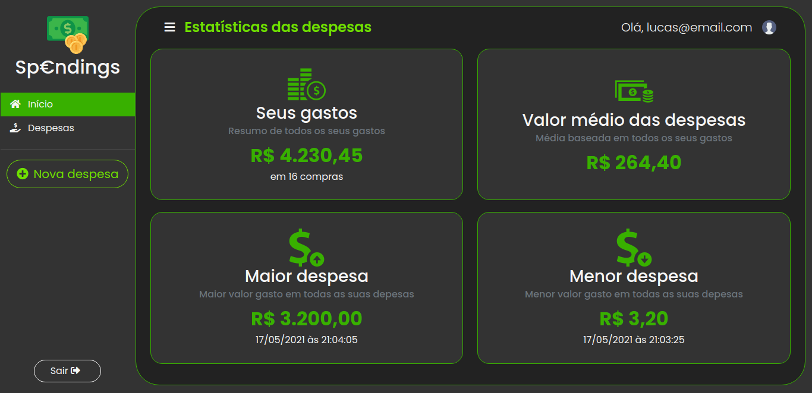

<h1 align="center">Spendings <br> Ajudando você a organizar suas despesas. 💸</h1>
<p>Aplicação desenvolvida com Vue JS, Bootstrap 4 e integrado com o Firebase.</p>

<h2>Telas:</h2>



<img src="src/assets/images/screenshots/spendings-list.png"

## Project setup
```
npm install
```

### Compiles and hot-reloads for development
```
npm run serve
```

### Compiles and minifies for production
```
npm run build
```

### Lints and fixes files
```
npm run lint
```

### Customize configuration
See [Configuration Reference](https://cli.vuejs.org/config/).
